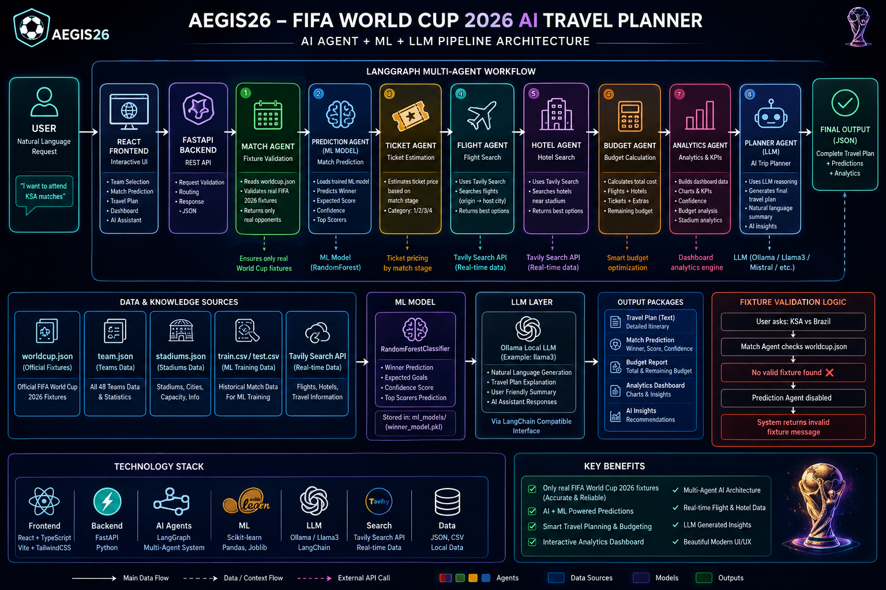

# ⚽ Aegis26 — FIFA World Cup 2026 AI Travel Planner

An advanced AI-powered FIFA World Cup 2026 travel planning platform built with:

- Multi-Agent AI Architecture
- Machine Learning Match Prediction
- Interactive Analytics Dashboard
- Real FIFA 2026 Fixtures
- Modern UI/UX Experience
- LLM-Powered Travel Assistant

Aegis26 helps football fans plan their complete World Cup experience intelligently — including matches, flights, hotels, budget optimization, and AI-powered match predictions.

---

# 🌍 Project Vision

The goal of Aegis26 is to transform FIFA fan travel planning into an intelligent AI experience.

Instead of manually searching:
- fixtures
- hotels
- flights
- budgets
- city information
- stadium details

Users can simply ask:

```txt
Prepare for me a trip to attend Saudi Arabia matches in World Cup 2026, the destnation from Dammam with budget 10000 SAR
```

And the AI system automatically:
- finds official matches
- validates fixtures
- predicts winners
- estimates goals
- calculates budgets
- recommends travel plans
- generates analytics dashboards

---

# 🚀 Main Features

## 🤖 Multi-Agent AI System

The project uses LangGraph-based collaborative AI agents.

Each agent handles a specialized task:

| Agent | Responsibility |
|---|---|
| Match Agent | Detects teams & official fixtures |
| Ticket Agent | Estimates FIFA ticket pricing |
| Flight Agent | Finds travel destinations & flights |
| Hotel Agent | Finds hotel/travel context |
| Budget Agent | Calculates complete travel costs |
| Prediction Agent | Predicts match outcomes using ML |
| Planner Agent | Builds the final intelligent response |

---

# 🧠 AI + LLM Architecture

The platform combines:

## ✅ Machine Learning
Used for:
- predicting winners
- expected goals
- confidence scores

### ML Model
- Random Forest Classifier
- Scikit-learn
- Trained on FIFA 2026 prediction dataset

---

## ✅ LLM Reasoning
Used for:
- natural language understanding
- travel planning logic
- intelligent response generation
- multi-agent orchestration

### LLM Stack
- LangChain
- LangGraph
- Ollama
- Tavily Search API

---

# 📊 Analytics Dashboard

The frontend includes an advanced analytics dashboard with:

- Match prediction visualizations
- Confidence indicators
- Budget analytics
- Travel cost breakdown
- Team performance analysis
- Interactive charts
- Stadium pages
- Dynamic prediction pages

---

# 🎨 UI/UX Features

Modern interactive frontend built with:

- React
- TypeScript
- Vite
- TailwindCSS
- Recharts

### UI Highlights
- Dark modern design
- Animated transitions
- Interactive cards
- Responsive layout
- Sound effects
- Dashboard pages
- Match prediction pages
- Dynamic team selection
- Real fixture validation

---

# ⚽ Real FIFA 2026 Fixture Validation

The system prevents unrealistic predictions.

Example:
- ✅ Saudi Arabia vs Spain
- ✅ Saudi Arabia vs Uruguay
- ❌ Saudi Arabia vs Brazil

The prediction engine only allows official FIFA 2026 fixtures from the dataset.

---

# 📈 Machine Learning Features

The ML model uses advanced football metrics:

- FIFA ranking
- FIFA points
- Team form
- Win rate
- Goals scored average
- Goals conceded average
- Clean sheets
- Passing accuracy
- Possession
- Market value
- Coach experience
- Climate similarity
- Host advantage
- Travel distance

---

# 🧩 System Pipeline



---

# 🔄 Full Architecture Flow

```txt
User Request
    ↓
React Frontend
    ↓
FastAPI Backend
    ↓
LangGraph Multi-Agent Workflow
    ↓
━━━━━━━━━━━━━━━━━━━━━━
Match Agent
Prediction Agent
Ticket Agent
Flight Agent
Hotel Agent
Budget Agent
Planner Agent
━━━━━━━━━━━━━━━━━━━━━━
    ↓
ML Prediction + LLM Reasoning
    ↓
Analytics Dashboard
    ↓
Final Intelligent Travel Plan
```

---

# 🗂 Project Structure

```txt
AI Agent Travel Planner/
│
├── agents/
│   ├── match_agent.py
│   ├── prediction_agent.py
│   ├── budget_agent.py
│   ├── planner_agent.py
│   ├── flight_agent.py
│   ├── hotel_agent.py
│   └── ticket_agent.py
│
├── data/
│   ├── worldcup.json
│   ├── teams.json
│   ├── stadiums.json
│   ├── train.csv
│   └── test.csv
│
├── ml_models/
│   ├── winner_model.pkl
│   └── model_features.pkl
│
├── src/
│   ├── components/
│   ├── pages/
│   ├── services/
│   ├── dashboard/
│   └── prediction/
│
├── main.py
├── train_match_model.py
├── requirements.txt
├── package.json
└── README.md
```

---

# ⚙️ Installation

# 1️⃣ Clone Repository

```bash
git clone https://github.com/yourusername/aegis26.git
cd aegis26
```

---

# 2️⃣ Backend Setup

```bash
python -m venv langgraph_env2
source langgraph_env2/bin/activate
```

Install dependencies:

```bash
pip install -r requirements.txt
```

---

# 3️⃣ Frontend Setup

Install frontend packages:

```bash
npm install
```

Run frontend:

```bash
npm run dev
```

---

# ▶️ Run Backend

```bash
uvicorn main:app --reload
```

Backend runs on:

```txt
http://127.0.0.1:8000
```

---

# 🌐 Frontend

Frontend runs on:

```txt
http://localhost:8080
```

---

# 🧪 Train ML Model

Train the prediction model:

```bash
python train_match_model.py
```

Outputs:
- winner_model.pkl
- model_features.pkl

---

# 📊 Example Queries

```txt
I want to attend ksa vs spain match
```

---

# 📈 Example AI Prediction

```txt
🏆 Predicted Winner: Spain

⚽ Expected Goals:
Spain: 3
Saudi Arabia: 1

🔥 Expected Top Scorers:
- Álvaro Morata
- Lamine Yamal

📈 Confidence: 70.7%
```

---

# 🛡 Technologies Used

## Backend
- FastAPI
- LangGraph
- LangChain
- Python
- Scikit-learn
- Pandas
- NumPy
- Joblib

## Frontend
- React
- TypeScript
- Vite
- TailwindCSS
- Recharts

## AI / ML
- Random Forest
- Predictive Analytics
- Multi-Agent AI
- LLM Orchestration

---

# 💡 Future Improvements

- Live FIFA APIs
- Real ticket booking
- Google Maps integration
- Live hotel APIs
- Real-time pricing
- Voice assistant
- AI itinerary optimization
- Multi-language support
- Live stadium navigation
- Mobile app deployment

---

# 👨‍💻 Author

## Mustafa Al Ali

AI Engineer

Specialized in:
- Multi-Agent AI Systems
- LLM Applications
- Computer Vision
- NLP
- ML Engineering
- RAG Systems

---

# ⭐ Acknowledgments

Datasets:
- FIFA World Cup 2026 Prediction Dataset
- FIFA Fixtures Dataset

Technologies:
- FastAPI
- LangGraph
- React
- Scikit-learn
- LangChain
- Ollama

---

# 📜 License

This project is for educational and portfolio purposes.
